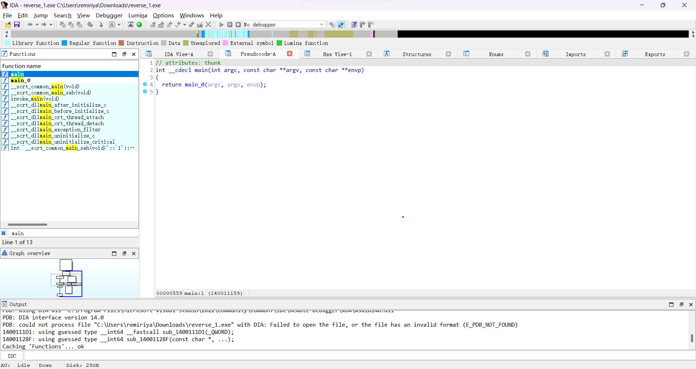
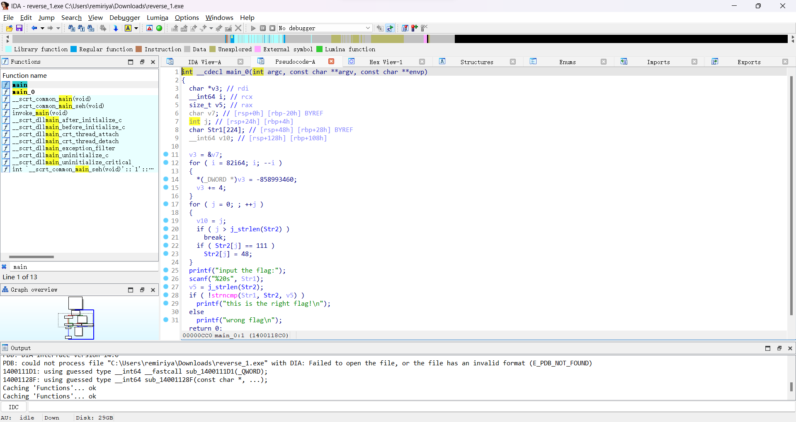
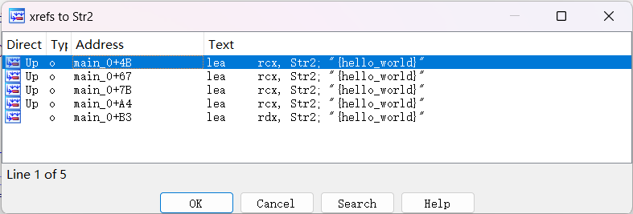
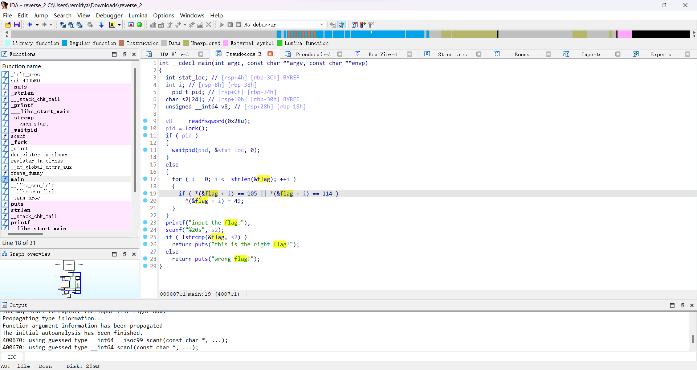
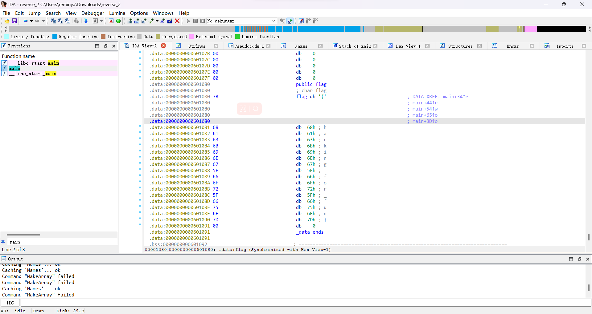
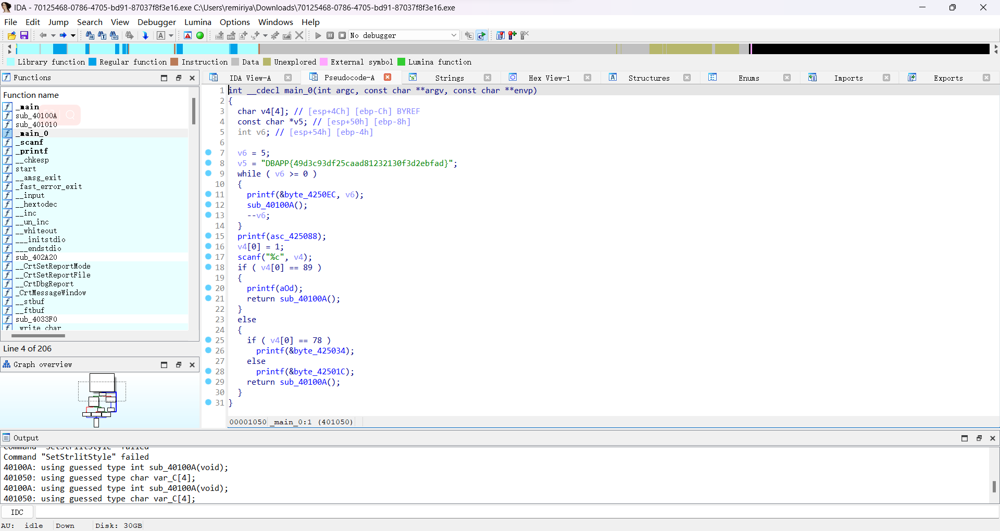
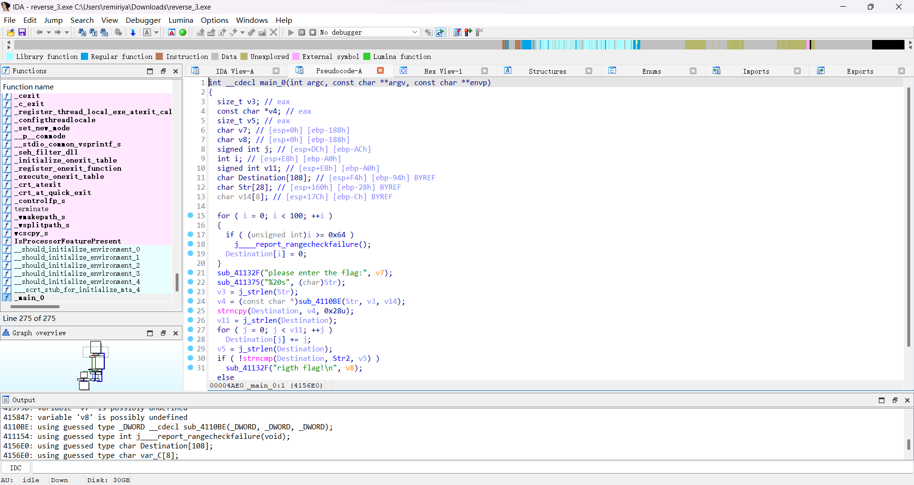
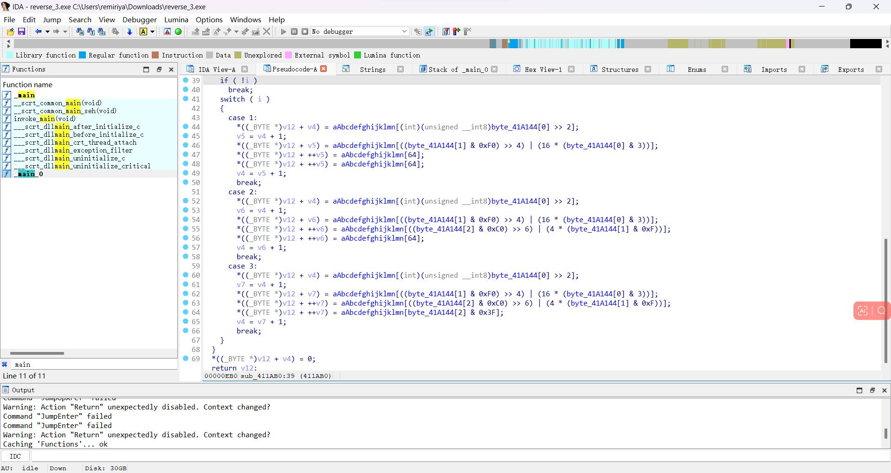

应组长要求~~完成任务~~将第一次写逆向题的过程记录一下  
顺便让以后的自己能够回过头来看看当初青涩的模样（感叹一下时光飞逝来装大佬）  

---

## 正文

### 一、easyre

首先，照葫芦画瓢，下载文件并解压，可以看到一个exe文件，直接拖入ida，可以看到以下界面  

然后继续照葫芦画瓢，找到主函数  

然后就找到了flag……  
虽然不知道发生了什么，但反正找到了，下一题。

### 二、reverse1

省略重复步骤，找到main函数  

嗯……好像啥都没有，但可以看到一个main_0函数，点进去  

然后翻译一下函数的内容，大概就是有一个`str2`字符串，程序会比较输入的字符串和str2字符串，如果一样就输出`this is the right flag`，那么目标应该就是要找到这个`str2`字符串的内容了  
那么要如何查看呢，这个时候就要求助我们万能的百度了，于是知道了按x可以查看变量的交叉引用，然后就可以看到`str2`的值为`hello_world`  
~~主要是因为真的找不到str2到底在哪里被赋的值~~

当然不要忘了前面有一个for循环对str2的值进行了改变，将asc值为111的字母改为了48。百度可知111为o，48为0。所以flag应为`hell0_w0rld`  

### 三、reverse2

继续第三题，这次的文件比较奇特，没有后缀名，但ida好像可以直接打开，就不管了  

好像跟上一题差不多，但这次的flag变成了指针，按x查看交叉引用会发现没有出现值  
……然后，经过半小时的摸索，终于在data区看到了flag  

因为我也不太清楚是怎么搞出来的……所以没有截图，大概就是根据百度，右键字符串然后点击array可以改变字符串长度（我没记错的话在没改变之前是没有显示字符的，不然我也不会找这么久了），然后随便调个长度，就显示出来了。  
同样，由于主函数对flag的值做了改变，这并不是最终的flag，最终的flag为`hack1ng_fo1_fun`  

### 四、新年快乐

这一题的文件是32位的，先换成32位的ida来打开，然后……整整318行代码，果断跳过。

### 四、内涵的软件

这题看半天没看出怎么写，然后被迫百度题解，然后发现答案就摆在面前……

主要是不知道这个DBAPP就指的flag，白找好久……

### 五、reverse3

~~还是reverse系列的题友好，不需要查壳之类的听不懂的操作。~~
找到主函数，还是熟悉的字符串比较

---

苦思半小时无果，百度题解，然后就看到了base64加密……  

鬼知道这个抽象的函数是base64加密啊！！！  

---

## 结尾

除了最简单的3题以外，基本全靠题解……基础的reverse知识还是知道的太少了，看到抽象点的函数基本只能跳过，还是先去找点reverse基础教程再写题吧……

